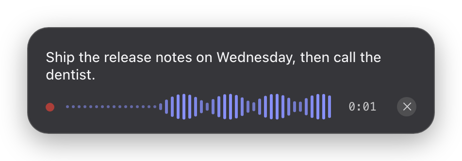
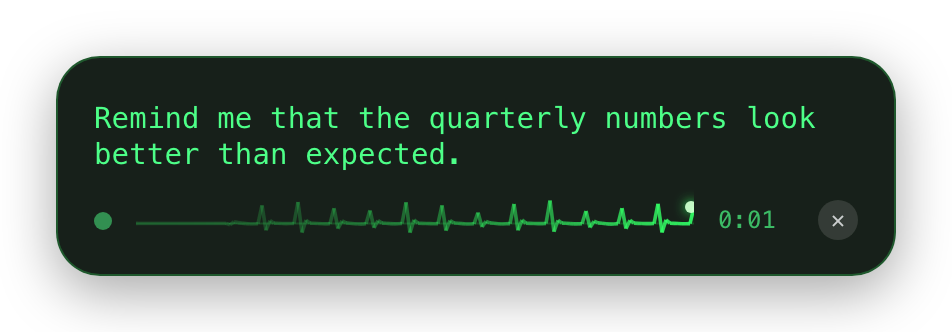
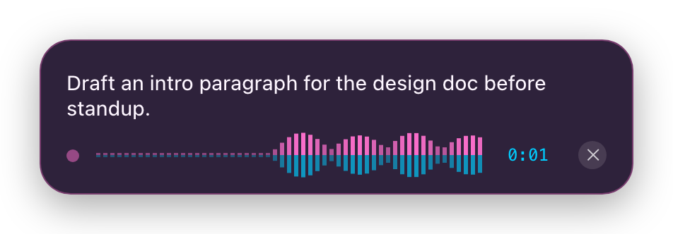

# Yat Yat

[](LICENSE)
[](https://github.com/jorgeper/yat-yat/releases/latest)

Fast, fully-local voice dictation for macOS and Windows. Press a hotkey
anywhere, talk, press it again — clean transcribed text lands at your cursor in
whatever app has focus.

- **Fully local.** Audio capture, speech-to-text, and cleanup all run on your
  machine. No cloud STT, no telemetry, no automatic update pings — ever. The
  only network operations are (a) one-time model downloads you start yourself,
  verified by SHA-256, (b) the optional transcript-enhancement pass, which is
  hard-locked to `localhost` endpoints in code, and (c) the **user-initiated**
  Check for Updates… — Rust-side, exclusively to this repo's GitHub Releases,
  responses verified against a public key baked into the app.
- **Fast.** Parakeet V3 (the recommended model) transcribes well past real-time
  on Apple Silicon; the active model stays warm-loaded between dictations.
- **Simple.** One hotkey, one overlay, one menu-bar icon.

<p align="center">
  <a href="docs/screenshots/pill-indigo-bars.png"></a>
  <a href="docs/screenshots/pill-phosphor-heartbeat.png"></a>
  <a href="docs/screenshots/pill-vaporwave-mirror.png"></a>
</p>

> **⚠️ Alpha** — Yat Yat is pre-release software (`0.1.0-alpha.7`).
> Builds are unsigned, formats may still shift, expect rough edges.

## Download

Grab the [**latest release**](https://github.com/jorgeper/yat-yat/releases/latest)
(while Yat Yat is in alpha, every build is flagged pre-release on GitHub, and
the latest-release link lands on the releases page with the newest alpha at
the top):

| Platform | File | Note |
| --- | --- | --- |
| **macOS** (Apple Silicon) | `Yat Yat_<version>_aarch64.dmg` | Unsigned — see [First launch on macOS](#first-launch-on-macos) |
| **Windows** (x64) | `Yat Yat_<version>_x64-setup.exe` | New and lightly tested. Unsigned — see [First launch on Windows](#first-launch-on-windows) |

Verify downloads against `SHA256SUMS.txt`. All versions:
[releases](https://github.com/jorgeper/yat-yat/releases).

### First launch on macOS

Alpha builds aren't Developer-ID-signed or notarized yet, so Gatekeeper
blocks the first open of a downloaded copy — depending on your macOS
version the dialog says *“Apple could not verify 'Yat Yat' is free of
malware”* or even *“'Yat Yat' is damaged and can't be opened”*. **Neither
means the download is broken** — it's Gatekeeper's wording for unsigned
apps. Click **Cancel/Done** (not Move to Trash!), then clear the
quarantine flag:

```bash
xattr -dr com.apple.quarantine "/Applications/Yat Yat.app"
```

(or, when your macOS offers it: System Settings → Privacy & Security →
scroll to *“Yat Yat” was blocked…* → **Open Anyway**.)

It's a one-time step per download; in-app updates
([Updates](#updates)) don't go through the browser, so they never hit it. The app then walks you through the
[permissions it needs](#permissions-macos) (microphone + Accessibility) and
your first model download. **Updating from a previous alpha:** unsigned
builds re-key the Accessibility grant — the app notices and walks you
through re-granting it.

### First launch on Windows

The Windows build is fresh out of the port (SPEC10) and lightly tested —
expect rougher edges than on macOS. The installer is unsigned, so
SmartScreen objects once: **More info → Run anyway**. No Accessibility-style
permission exists on Windows — the hotkey and paste work out of the box; if
the microphone is blocked, enable it under Settings → Privacy & security →
Microphone. Inference currently runs on CPU on Windows (GPU/Vulkan
acceleration is blocked on an upstream build issue — see BLOCKERS.md);
smaller models like Whisper Tiny/Small and Parakeet stay comfortably fast.

## How it works

1. Press **Right ⌘** (configurable, bare modifier keys supported). A small pill
   appears with a live waveform — the app you're typing in keeps focus. While
   recording, the menu-bar mic carries a **red dot** so there's always an
   ambient "mic is live" indicator, and an optional sound cue (Settings →
   General, off by default) ticks on start and clicks when text is delivered.
2. Talk. Press the hotkey again (or use hold-to-talk mode). `Esc` cancels.
3. The transcript is cleaned — filler words (`um`, `uh`, …), bracketed noise
   tags, and stuttered repeats are stripped, and your personal dictionary is
   applied — and pasted at your cursor. Your previous clipboard contents are
   restored right after.

**Focus guard.** If you switch apps mid-dictation (start in Terminal, ⌘-tab
to Slack while talking), Yat Yat notices that the frontmost app changed and
asks before pasting: *"Started in Terminal — paste into Slack?"* with
**Paste** and **Copy only** buttons (pressing the hotkey again also confirms
the paste; `Esc` dismisses). An unanswered prompt falls back to
copy-to-clipboard after 10 seconds — and whatever happens, the transcript is
already in History, so nothing is ever lost. The guard fails open (any
uncertainty means a normal paste) and can be turned off in Settings →
General → "Ask before pasting into a different app".

The menu-bar icon gives you: start/stop dictation, copy or retry the last
transcription, your five most recent transcriptions, and Settings. The icon
itself shows state — idle, **recording (red dot)**, and processing.

## Looks

Settings → **Appearance** picks the recording visualizer (15 effects, from
the classic bars to oscilloscope, starfield, fireflies, and aurora) and the
overlay theme (12 built-ins — Phosphor CRT, Vaporwave, Nord, Newsprint, …),
with a live preview that runs the real engine on fake voice. Fonts are part
of the theme. You can also write your own theme as a single CSS file — see
[THEMES.md](THEMES.md) for the contract and the drop-in folder.

## Live transcription

While you speak, the overlay shows your words above the waveform — stabilized
text renders solid, the still-changing tail renders dimmed, and text that has
appeared never rewrites itself. What you see live is the raw engine output;
**what pastes is always the final, cleaned transcription**, so an "um" you
glimpse live never lands in your document. Toggle it in Settings → General →
"Live transcription" (on by default). On slower machines the live view simply
updates less often — it never affects the recording or the final result.

## Models

Yat Yat ships no models; pick one in Settings → Models (or during onboarding):

| Model | Size | Languages | Notes |
| --- | --- | --- | --- |
| **Parakeet V3** (recommended) | ~460 MB | 25 European | Best speed/quality balance (ONNX) |
| Whisper Large v3 Turbo | ~1.6 GB | 99 | Best multilingual (whisper.cpp, Metal) |
| Whisper Small | ~470 MB | 99 | Mid-size multilingual |
| Whisper Tiny | ~75 MB | 99 | Quick start; used by the test harness |

The catalog is data-driven: adding a model is one new entry in
`src-tauri/models.json` (id, engine family, URL, SHA-256, size) — no code
changes.

## Updates

**Yat Yat ▸ Check for Updates…** (also in the menu-bar tray menu) checks
GitHub Releases for a newer version — strictly when you ask, never on a
schedule — then downloads, verifies the signature against the public key
baked into the app, installs, and relaunches on your click. Updates are
hosted on this repo's [releases](https://github.com/jorgeper/yat-yat/releases);
builds older than the updater itself need one manual download first.

## Personal dictionary

Settings → Cleanup has a personal dictionary: words or phrases the model
keeps getting wrong, replaced in every transcript — names, jargon, product
names ("jorge pereira" → "Jorge Pereira"). Matching is literal whole words,
any capitalization, multi-word phrases included; entries apply everywhere the
cleanup pipeline runs (normal dictation, Retry, and before optional AI
enhancement, so the enhancer sees corrected names too). One note: the
dictionary runs after repeated-word collapsing, so a phrase made of an
immediately repeated word ("yat yat") only matches if "Collapse repeated
words" is off.

## Optional AI enhancement (still local)

Settings → Cleanup can pipe each transcript through a small local LLM for
punctuation/grammar repair and spoken self-corrections ("…no wait, Wednesday").
It's **off by default** and only accepts localhost endpoints:

```bash
brew install ollama
ollama pull qwen3:4b
# then enable Enhancement in Settings → Cleanup and press Test
```

If enhancement takes longer than 5 seconds, Yat Yat pastes the plain cleaned
text instead — dictation never waits on a slow model.

## Permissions (macOS)

First-run setup walks these one screen at a time, and each screen verifies
the *actual* system state before it lets you continue — clicking a button
never advances the flow; the permission really appearing does. You can go
back at any point (the ‹ Back button or the progress dots) to re-read a
step's instructions, even one that's already satisfied — it shows in its
green "met" state and never yanks you forward while you read. Settings →
General → "Re-run setup" replays the whole walkthrough from the top, with
everything that still passes shown as met.

1. **Microphone** — to hear you. The wizard triggers the native prompt and
   waits until the permission is genuinely granted. Not skippable.
2. **Accessibility** — for two things only: listening for the global hotkey
   (including bare modifiers, which the sanctioned hotkey APIs can't do) and
   pressing ⌘V to paste. The wizard waits for the grant *and* for the hotkey
   listener to actually arm before continuing (grants made mid-session are
   picked up within ~3 s). Skippable — Yat Yat degrades to copy-to-clipboard.
3. **Menu Bar** (macOS 26+) — Tahoe decides which apps may show a menu-bar
   icon. The wizard checks whether Yat Yat's icon is *really* rendering (not
   just created) and walks you to System Settings → Menu Bar → "Allow in the
   Menu Bar" if it isn't. Skippable — the hotkey works without the icon.

Yat Yat is distributed outside the Mac App Store because sandboxed apps cannot
synthesize paste keystrokes.

## Troubleshooting

### The menu-bar icon doesn't appear (macOS 26 Tahoe)

macOS 26 gates third-party menu-bar items behind a per-app permission — the
status item is created but the system collapses it to zero width, so the app
runs fine with no visible icon. This affects many menu-bar apps, not just
Yat Yat ([tauri#13770](https://github.com/tauri-apps/tauri/issues/13770),
[tray-icon#273](https://github.com/tauri-apps/tray-icon/issues/273)).

To fix:

1. Open **System Settings → Menu Bar** (on some builds: System Settings →
   Control Center, "Menu Bar Only" section).
2. Scroll to the list of apps allowed in the menu bar.
3. Find **Yat Yat** and turn on **Allow in the Menu Bar**.
4. Quit Yat Yat (the hotkey still works — or `pkill -x yat-yat`) and relaunch
   it.

Notes:

- Yat Yat only appears in that list after it has been launched at least once
  from the `.app` bundle (not `tauri dev`).
- A crowded menu bar can also hide icons silently — on notched MacBooks,
  macOS drops items that overflow under the notch. Try removing an icon or
  two (⌘-drag them out) if the toggle alone doesn't do it.
- If Yat Yat never shows up in the list, the fallback is signing the bundle
  with a real Developer ID identity (`bundle > macOS > signingIdentity` in
  `tauri.conf.json`) — Tahoe ties menu-bar permissions to signed bundles.

### The hotkey stopped working

If the Accessibility permission is revoked or re-keyed (updates to dev builds
do this), the settings window shows a warning banner on every section: "The
dictation hotkey is inactive…" — click **Fix in setup** and the wizard opens
directly on the broken gate; fixing it resumes everything, no relaunch. The
same button appears on the Hotkey section's error. For a full re-check of
everything (permissions, menu-bar icon, models), use Settings → General →
**Re-run setup** — steps that still pass are skipped automatically.

### Dictation says "Pick a model" unexpectedly

The active model lives in `~/Library/Application Support/com.yatyat.app/
settings.json` (`active_model`). If it's ever null despite a downloaded model,
pick the model again in Settings → Models. (A bug where saving any other
setting reset the active model was fixed in 0.1.0 — update if you're on an
older build.)

## Build

Prerequisites: Rust (stable), Node 20+, Xcode Command Line Tools, cmake.

```bash
npm install
npm run tauri build        # produces the .app under src-tauri/target/release/bundle
npm run tauri dev          # development mode
npm run validate           # full test harness (R, U, E, I suites)
```

`npm run validate` downloads Whisper Tiny (~75 MB) once into
`~/.cache/yatyat-validate/` for the integration test; everything else runs
offline.

## Installing dev builds

The quickest loop for trying a new build:

```bash
npm run tauri build     # produces src-tauri/target/release/bundle/macos/Yat Yat.app
npm run install:app     # kills the running app, replaces /Applications/Yat Yat.app, relaunches
```

`install:app` does the equivalent of:

```bash
pkill -x yat-yat                                   # quit the running instance
rm -rf '/Applications/Yat Yat.app'                   # remove the previous version
ditto 'src-tauri/target/release/bundle/macos/Yat Yat.app' '/Applications/Yat Yat.app'
open '/Applications/Yat Yat.app'
```

Notes:

- **Install to /Applications rather than running from `target/`.** macOS keys
  permissions (mic, Accessibility, menu-bar allowance) and the launch-at-login
  entry to the app's identity and path — a stable `/Applications/Yat Yat.app`
  keeps them attached across builds. Running the bundle straight out of
  `target/` works for a quick look, but every `tauri build` recreates that
  path and permissions get flaky.
- Use `ditto` (not Finder drag or `cp -R`) — it preserves the bundle metadata
  and code signature exactly.
- Dev builds are ad-hoc signed, and the signature changes with every build —
  macOS pins the Accessibility grant to the old signature, so the checkbox
  looks enabled while the new build is silently denied. `install:app` handles
  this by running `tccutil reset Accessibility com.yatyat.app` on every
  install: each new build asks for Accessibility once, cleanly, instead of
  failing mysteriously. (With a real Developer ID signing identity configured
  in `tauri.conf.json`, grants persist across builds and the reset becomes
  unnecessary.)
- The mic permission and the Menu Bar allowance are keyed to the bundle id
  (`com.yatyat.app`) and survive reinstalls; you should not need to re-grant
  them.
- `pkill -x yat-yat` is safe anytime — settings, history, and models live in
  `~/Library/Application Support/com.yatyat.app/`, untouched by reinstalls.

### Full reset (true first run)

`rm -rf '/Applications/Yat Yat.app'` alone is NOT a clean uninstall — macOS
keeps state keyed to the bundle id: the microphone/Accessibility grants
(TCC), app data (settings, so onboarding stays "complete"), preferences, and
WebKit storage all survive. To wipe everything and get the untouched
first-run experience:

```bash
npm run clean:app     # runs scripts/deep-clean.sh
npm run install:app   # fresh install → full onboarding, mic prompt and all
```

What it removes: the bundle, `~/Library/Application Support/com.yatyat.app`
(settings/history/**models — the big downloads**), mic + Accessibility grants
(`tccutil reset`), preferences, WebKit/caches/saved state, and the
launch-at-login agent.

Two things no script can reset — do them by hand for a 100% pristine run:

1. **Menu Bar allowance**: System Settings → Menu Bar → find Yat Yat → turn
   OFF "Allow in the Menu Bar" (Control Center owns this state; there is no
   public API or `tccutil` service for it).
2. Nothing else — everything else is covered.

To re-run just the wizard WITHOUT wiping anything (keeps models and
permissions): Settings → General → **Re-run setup**. Steps whose checks
already pass are skipped automatically, so a fully-configured app jumps
straight to the Try It screen.

## Architecture

See [docs/ARCHITECTURE.md](docs/ARCHITECTURE.md) for the module map, the
platform-abstraction boundary for the Windows port, and measured performance
numbers. The specs that drove each milestone live in
[docs/specs/](docs/specs/) (with their `/goal` launchers in
[docs/goals/](docs/goals/)); releases are cut per
[docs/RELEASING.md](docs/RELEASING.md); themes are documented in
[THEMES.md](THEMES.md). The build stands on excellent open source: patterns
adapted from [Handy](https://github.com/cjpais/Handy) (MIT),
[transcribe-rs](https://github.com/cjpais/transcribe-rs),
[handy-keys](https://github.com/handy-computer/handy-keys),
[tauri-nspanel](https://github.com/ahkohd/tauri-nspanel), and
[whisper.cpp](https://github.com/ggml-org/whisper.cpp).

## License

[MIT](LICENSE) © 2026 Jorge Pereira. Bundled third-party packages are listed
in [THIRD-PARTY-NOTICES.md](THIRD-PARTY-NOTICES.md) (regenerated by
`npm run licenses`, which fails on any non-permissive license); the license
decision record is [docs/license.md](docs/license.md). STT models are
downloaded by you at runtime, never bundled — Parakeet V3 is CC-BY-4.0
(NVIDIA), Whisper models are MIT.
